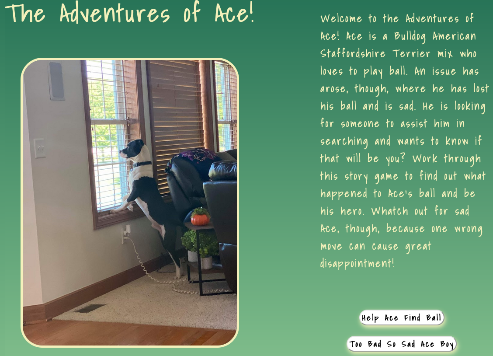

# The Adventures of Ace!

## About:
Welcome to the Adventures of Ace! Ace is a Bulldog American 
Staffordshire Terrier mix who loves to play ball. An issue has arose, though, 
where he has lost his ball and is sad because of this. He is looking for someone to assist him 
in searching and wants to know if that will be you? Work through this story game to 
find out what happened to Ace's ball and be his hero. Watch out for sad Ace, though, 
because one wrong move can cause great disappointment!

## Link to [Play Game](https://adventures-of-ace.netlify.app/)
### Link to [Whimsical Planning](https://whimsical.com/adventures-of-ace-jAbpv3XV6WjVaaUkJjwfP)

## Technologies Used:
* JavaScript
* HTML5
* CSS

## Assets:
* Paw Print favicon used from Isabella Baillie on Giphy - 
    https://giphy.com/stickers/paw-pawprint-print-fXWP44L91ioNZQSh2G
* Add "Fade In" animation to text from Animate.css
* Traversy Media: "Markdown Crash Course" for creating     
    README - https://www.youtube.com/watch?v=HUBNt18RFbo
* Confetti library used for party with Ace.
* Sound used from Xcreenplay on freesound.org - https://freesound.org/people/Xcreenplay/sounds/577905/
* All pictures and videos were taken by the creator of the game.

## Future Features:
"Play Ball" extension to allow the player to play ball with Ace once the ball is found. 
